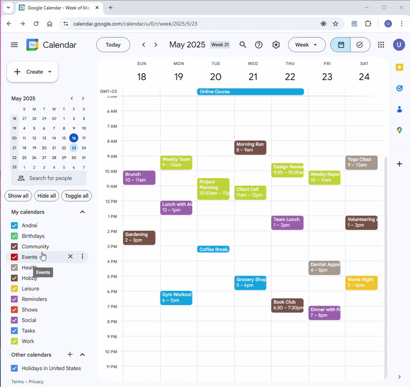

#  Show and Hide all calendars buttons for Google Calendar™ 

Free browser extension that adds 3 buttons to Google Calendar:  
**Show all** / **Hide all** / **Toggle all** (calendars)

## Installation
| Source | Version |
| -------- | ------- |
| [Chrome](https://chromewebstore.google.com/detail/show-and-hide-all-calenda/hpailgnhcndggnllpgahjehfcalnefnj) | v0.7.1 |
| Edge | soon |
| Firefox | soon |
| [GitHub](https://github.com/andrei-lazarov/GoogleCalendar-ShowAll/releases/latest) (load unpacked) | v0.8

## Demonstration

<picture>
  <source media="(prefers-color-scheme: dark)" srcset="./images/demo_dark.gif">
  
</picture>
